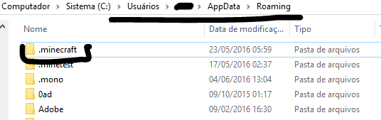
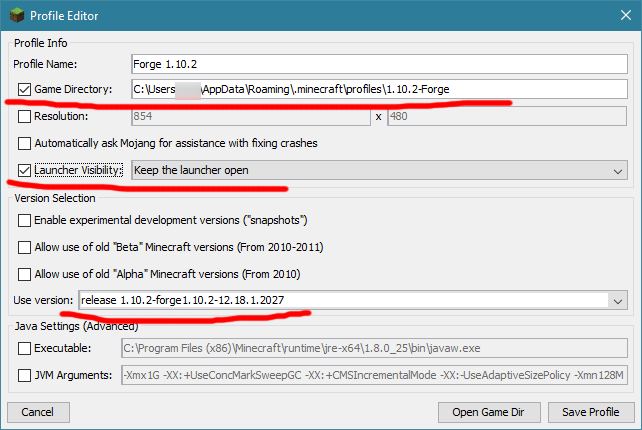

# Tutorial

## Preparando o Minecraft

*Passos necessários para quem ainda não tem o Minecraft no PC ou tem uma versão muito antiga!* *Para os outros sigam para* **Instalando a versão do Minecraft** *e daí pra* **"Atualizando o Forge"** *!*

1. **[OPCIONAL CASO QUEIRA LIMPAR UMA INSTALAÇÃO VELHA]**. Acesse a pasta `%AppData%` e **apague** a pasta `.minecraft`;

2. Baixe o Launcher do Minecraft, caso você não tenha uma pasta .minecraft salve o `.jar`/`.exe` do launcher em uma pasta temporária, senão salve na própria `.minecraft`;
3. **[OPCIONAL CASO NÃO TENHA UMA *.MINECRAFT* OU TENHA A LIMPO]** Execute uma vez o Launcher, sem iniciar o jogo; Se você não tinha uma pasta `.minecraft`, agora vai ter. Feche o launcher e (caso não seja o orginal c/ instalador) mova-o para dentro da pasta `.minecraft`;
4. Na pasta `.minecraft`, crie uma pasta exatamente chamada `profiles`. Nela ficarão, separados por versão (e com ou sem o Forge instalado) dados como configurações, mods, mapas e resource packs;
5. Abra o launcher. Você irá ver no canto inferior esquerdo uma lista de Profiles. Dependendo do launcher, a única entrada que estará presente é ou *"Default"* ou o seu nick;

6. De qualquer forma, edite essa única entrada: clique em *Edit Profile*, renomeie para *"Default"* (se já não tem), marque a caixa *"Game Directory"* e coloque no campo do caminho `<caminho-da-pasta-.minecraft>\profiles\Default`. Desmarque *"Automatically ask Mojang for assistance with fixing crashes"* e certifique-se de que o campo *"Use version"* está alterado para ***"Use latest version"***.

7. Clique em *"Save Profile"*, selecione o perfil que acabou de criar/editar e clique em **Play**. Ao entrar no menu inicial do jogo, configure as opções de vídeo, controles e afins. Então feche o jogo;
8. Siga para a seção **Instalando a versão do Minecraft** para instalar a versão a ser jogada.

## Instalando a versão do Minecraft

1. Vá até a [página de versão](version.md) pra saber qual versão está sendo usada no server, além da lista de mods. Se estiver seguindo o tutorial fora do VicoCraft, apenas escolha a sua versão do Minecraft e Forge desejadas;
2. Na pasta `profiles` copie a pasta `Default` e renomeie a cópia com o número da versão do Minecraft desejada (ex.: `1.10.2`);

3. Novamente no launcher, selecione o perfil *Default* e clique em *"New Profile"*;

4. Dê ao perfil o nome *"<número da versão> Vanilla"* (ex.: *1.10.2 Vanilla*), marque a caixa "Game Directory" e coloque no campo do caminho `<caminho-da-pasta-.minecraft>\profiles\<número da versão>_vanilla` (ex.: `C:\Users\Fulano\AppData\Roaming\.minecraft\profiles\1.10.2_vanilla`). Desmarque "Automatically ask Mojang for assistance with fixing crashes" e certifique-se de que o campo "Use version" está setado para a versão correspondente (ex.: *1.10.2*).

5. Clique em "Save Profile", selecione o perfil que acabou de criar/editar e clique em Play. Ao entrar no menu inicial do jogo, configure os detalhes adicionais da versão e feche o jogo.
6. Siga para **Instalação do FORGE** ou **Atualização do FORGE** caso queira atualizar a versão do Forge **para a mesma versão** do Minecraft.

## Instalação do FORGE

1. Acesse o [repositório do Forge](http://files.minecraftforge.net) e navegue até a versão pedida/desejada (ex.: se for a versão __1.10.2__ clique no botão __1.10__ e daí no menu que abrir escolha a versão __1.10.2__);

2. Clique em *"Show all downloads"* e escolha a versão pedida pelo master/desejada, geralmente é a primeira da lista (a última);
3. Clique no botão "*(i)*" ao lado de *"Installer-win"* (ou *"installer"* caso esteja no Linux) para baixar o instalador do Forge sem precisar passar pelo adf.ly;

4. Salve o instalador em uma pasta temporária (**não** a mesma do minecraft);
5. Execute o instalador e clique em "Install client". **Não mude o caminho da pasta de baixo!**

6. Deixe ele instalar. Ele vai mostrar uma mensagem de confirmação. Dê OK;
7. (OPCIONAL). Copie a pasta `<caminho-da-pasta-.minecraft>\profiles\<número-da-versão>` para `<caminho-da-pasta-.minecraft>\profiles\<número-da-versão>_forge` para manter as configurações da versão vanilla para o Forge;

8. Inicie o launcher. Você verá que surgiu um perfil novo chamado *"forge"*. Selecione-o e clique em *Edit Profile*;
9. Renomeie o perfil pra *"<número-da-versão> Forge"* (ex.: 1.11.2 Forge), marque o Game Directory e preencha o campo com `<caminho-da-pasta-.minecraft>\profiles\<número-da-versão>_forge` (ex.: `C:\Users\Fulano\AppData\Roaming\.minecraft\profiles\1.10.2_forge`). **Opcionalmente** verifique se o campo *"Use Version"* está de acordo com a versão do Forge que você baixou e, caso tenha crashes frequentes, marque a opção *"Launcher Visibility"* como *"Keep the launcher open"* para pegar logs;

10. Execute o profile "`<número-da-versão>` Forge", espere chegar na tela de menu do jogo e saia;
11. Siga para a [página "Versão Atual"](version.md) para baixar os mods (caso tenha dúvidas ou não consiga baixar algum entre em contato comigo). Coloque os mods na pasta `<caminho-da-pasta-.minecraft>\profiles\<número-da-versão>_forge\mods` (ex.: `C:\Users\Fulano\AppData\Roaming\.minecraft\profiles\1.11.2_forge\mods`) e **não** diretamente na pasta `.minecraft\mods`! Veja como fica cada subpasta em "profiles":

## Atualização do FORGE

Para atualizar a versão do FORGE em uma mesma versão do Minecraft (não para instalar uma nova versão do Minecraft, veja **Instalando a versão do Minecraft** e siga na leitura para isso)!

1. Faça os passos 1 à 6 de **Instalação do FORGE**;
2. Inicie o Launcher Minecraft. Você verá que surgiu um perfil novo chamado *"forge"*;
3. Clique na aba *"Profile Editor"*. Note a coluna *version* na lista de Profiles;

4. Selecione o perfil da versão à ser atualizada (ex.: 1.11.2 Forge) e dê duplo clique;
5. No campo "Use Version", selecione **a mesma versão** do Forge que o perfil *"forge"* criado pelo instalador;
6. IMPORTANTE PRA EVITAR PROBLEMA! Apague o perfil "forge" criado acima (botão direito no perfil e *"Delete Profile"*;

7. Inicie o Minecraft usando o Perfil que você acabou de alterar (ex.: Forge 1.10.2);
8. (OPCIONAL) Apague a pasta correspondente às versões antigas do Forge (**para a mesma versão do Minecraft**) em `<pasta-do-minecraft>\libraries\net\minecraftforge\forge`. Não apague as pastas de versões do forge para outras versões do Minecraft!

9. Siga para a [página "Versão Atual"](version.md) para verificar atualizações para os mods (caso tenha dúvidas ou não consiga baixar algum entre em contato comigo), e lembre-se novamente: coloque os seus mods na pasta `<caminho-da-pasta-.minecraft>\profiles\<número-da-versão>_forge\mods` (ex.: `C:\Users\Fulano\AppData\Roaming\.minecraft\profiles\1.12.2_forge\mods`) e **não** diretamente na pasta `.minecraft\mods`! Veja como fica cada subpasta em "profiles":
